# dolphinscheduler-project
This purpose of this repo is to record some tricks and solutions during the process of
the ds-cluster building.

<center>
   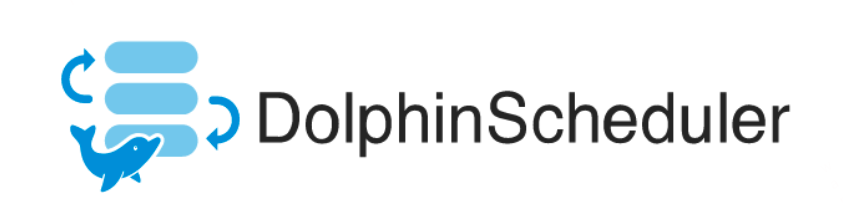
</center>

___
## Catalogue
- [dolphinscheduler-project](#dolphinscheduler-project)
  - [Catalogue](#catalogue)
  - [Main DS Service Composition](#main-ds-service-composition)
  - [Important Glossary](#important-glossary)
  - [Build a Cluster](#build-a-cluster)
    - [Configuration Information](#configuration-information)
      - [1. Test Servers Info](#1-test-servers-info)
      - [2. zookeeper](#2-zookeeper)
      - [3. mysql](#3-mysql)
      - [4. dolphin scheduler project](#4-dolphin-scheduler-project)
      - [5. others](#5-others)
    - [_aso-alert_ project deployment test](#aso-alert-project-deployment-test)


## Main DS Service Composition
DolphinScheduler mainly consists of five services: 
- MasterServer：Mainly responsible for DAG segmentation and task status monitoring
- WorkerServer/LoggerServer：Mainly responsible for the submission, execution and update of task status. LoggerServer is used for Rest Api to view logs through RPC
- ApiServer：Provides the Rest Api service for the UI to call
- AlertServer：Provide alarm service
- UI: Front page display

## Important Glossary
- __Priority__: Support the priority of process instances and task instances, if the priority of process instances and task instances is not set, the default is __first-in-first-out__.
- __Task/Process Priority__: When the number of __worker/process threads__ is insufficient, high-level tasks will be executed first in the execution queue, and tasks/process with the same priority will be executed in the order of first in, first out.
- __Failure Strategy__: notification strategy, process priority, worker group, notification group, recipient, and CC are the same as workflow running parameters.
- __SubProcess__: The sub-process node is to execute a certain external workflow definition as a task node.

## Build a Cluster
### Configuration Information
#### 1. Test Servers Info
- backend-pulsar-101
- backend-pulsar-102
- backend-pulsar-103

#### 2. zookeeper

version：3.7.1
- leader: backend-pulsar-102
- follower: backend-pulsar-101, backend-pulsar-103


#### 3. mysql
version：8.0
Depoy on the docker on the _backend-pulsar-101_ server. 

> Due to ds meta data are stored in the database, it's recommended that the mysql database should be built in the cluster server or the server which owns the __low latency__ to the ds cluster. Otherwise, the io, ui and so on of ds cluster will be badly affected.
<center>
   
</center>

#### 4. dolphin scheduler project

ds version: 2.0.5

<center>
   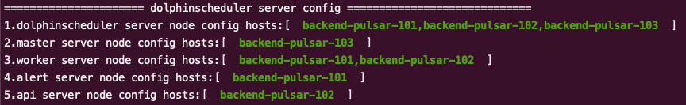
</center>

#### 5. others
configuration:
```shell
# The directory to install DolphinScheduler for all machine we config above. It will automatically be created by `install.sh` script if not exists.
# Do not set this configuration same as the current path (pwd)
installPath="/data1_1T/dolphinscheduler"

# Log path
logpath="/data1_1T/dolphinscheduler/logs"

# The directory to store local data for all machine we config above. Make sure user `deployUser` have permissions to read and write this directory.
dataBasedirPath="/tmp/dolphinscheduler"

# resource store on HDFS/S3 path, resource file will store to this hdfs path, self configuration, please make sure the directory exists on hdfs and has read write permissions. "/dolphinscheduler" is recommended
resourceUploadPath="/dolphinscheduler"
```

### _aso-alert_ project deployment test
1. worker group
   
DS is allowed to divide workers to organize as work group, and appoint related task executed on specific group.

User need to configure the required environment (such as JAVA_HOME, PYTHON_HOME and so on) in the group to support the program.

   
2. environment manage

I used pyenv and virtualenv to install the python3.9.4, and ds allow user to export environment variables configs in ui, as shown in following pic.

   
<center>
   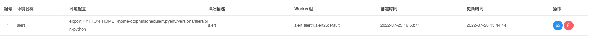
</center>

3. resources

To run alert project, related resources need to be uploaded. Resources -> upload.

>   __Attention__:
> 1. DS 2.0.5 only support upload file level resources and batch upload method is not allowed currently.
>  Also, if user selects local-storage method for resource, only upoload resource on ui or api are valid,copying file to the target server folder will not map to the meta database.
> 2. There is a bug in DS 2.0.5 that process cannot find the resource, which may be caused by server saving the upload resources in the error local storage path.
> Please check it in the server or reupload the resource.

   - Server：
      <center>
         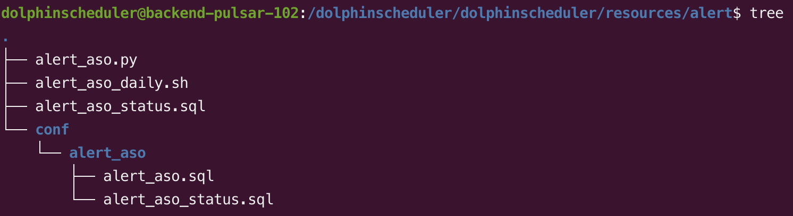
      </center>
   - ui：
   <center>
      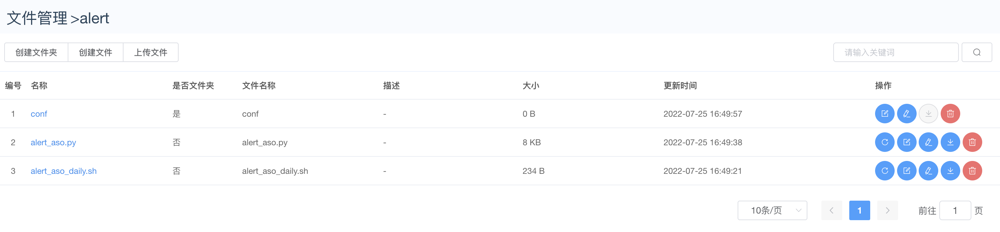
   </center>

   - DAG
      <center>
         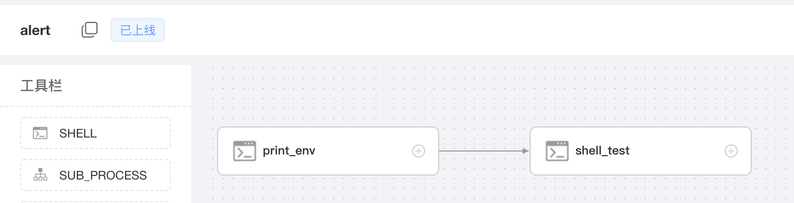
      </center>

   - Task
      <center>
         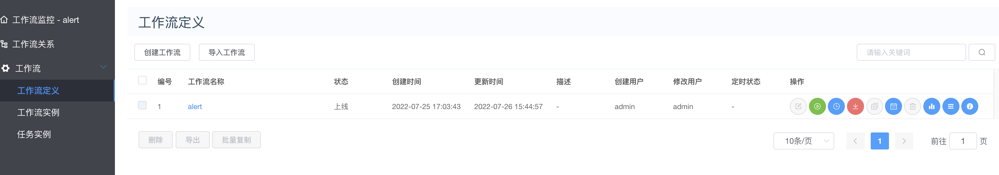
      </center>
   
   - Log
      <center>
         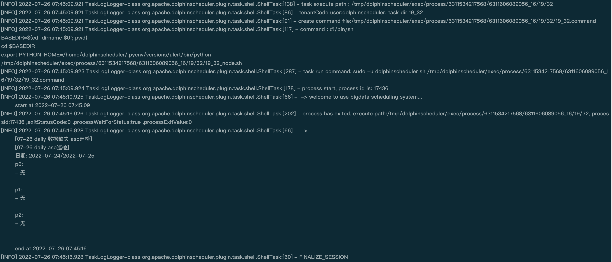
      </center>

## Problem And Solution
### 1. Telant dosen't exist

> Cause：In meta database, table t_ds_user's tenant_id dosen't match t_ds_tenant's id, which cause the telant dosen't exist.

<center>
   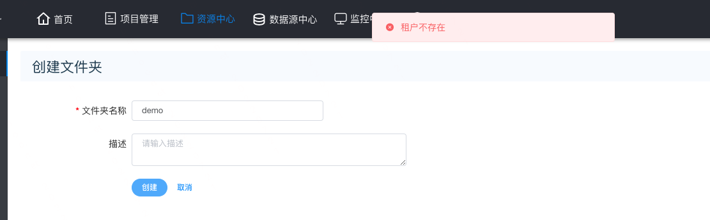
</center>

__Solution：__

update the tenant_id to match the with id.

```mysql
# check data of tables t_ds_tenant and t_ds_user.
use dolphinscheduler;
select * from t_ds_tenant;
select * from t_ds_user;    
```
As shown following, tenant_id didn't match ID, update tenant_id.
```mysql
update t_ds_user set tenant_id=[] where user_name=[];
```
<center>
   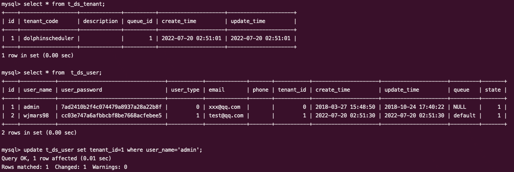
</center>


### 2. Datasource fail to connect mysql

> Cause：The license of mysql jdbc connector is not compatible with apache v2 license, so it can't be included by docker image.


<center>
   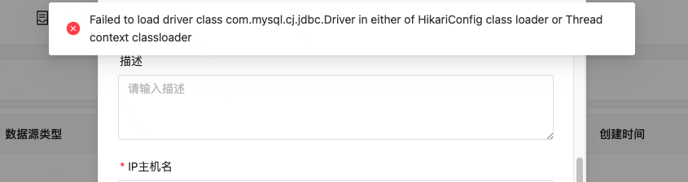
</center>

Dolphinscheduler acquiescently appoint PostgreSQL as meta database, so mysql driven should be added to connect mysql database.


__Solution：__

#### (Pseudo) cluster 
1. add jdbc driven
```shell
mkdir tmp && cd tmp
wget https://downloads.mysql.com/archives/get/p/3/file/mysql-connector-java-8.0.16.tar.gz
tar -zxvf mysql-connector-java-8.0.16.tar.gz
cd mysql-connector-java-8.0.16

# ds version 2.0.*
cp mysql-connector-java-8.0.16.jar /path/to/apache-dolphinscheduler-2.0.*-bin/lib

# ds version 3.0.*
cp mysql-connector-java-8.0.16.jar /path/to/apache-dolphinscheduler-3.0.*-bin/tools/libs
```

1. init meta database

grant the privilege of dolphinscheduler database to appointed user.

_mysql 5.6 / 5.7_
```mysql
mysql -uroot -p

mysql> CREATE DATABASE dolphinscheduler DEFAULT CHARACTER SET utf8 DEFAULT COLLATE utf8_general_ci;

# 修改 {user} 和 {password} 
mysql> GRANT ALL PRIVILEGES ON dolphinscheduler.* TO '{user}'@'%' IDENTIFIED BY '{password}';
mysql> GRANT ALL PRIVILEGES ON dolphinscheduler.* TO '{user}'@'localhost' IDENTIFIED BY '{password}';

mysql> flush privileges;
```

_mysql 8_

```mysql
mysql -uroot -p

mysql> CREATE DATABASE dolphinscheduler DEFAULT CHARACTER SET utf8 DEFAULT COLLATE utf8_general_ci;

# 修改 {user} 和 {password} 
mysql> CREATE USER '{user}'@'%' IDENTIFIED BY '{password}';
mysql> GRANT ALL PRIVILEGES ON dolphinscheduler.* TO '{user}'@'%';
mysql> CREATE USER '{user}'@'localhost' IDENTIFIED BY '{password}';
mysql> GRANT ALL PRIVILEGES ON dolphinscheduler.* TO '{user}'@'localhost';
mysql> FLUSH PRIVILEGES;
```

3. update dolphinscheduler_env.sh
```shell
# 修改ds环境配置，修改指定数据库为mysql，以及元数据库
export DATABASE=${DATABASE:-mysql}
export SPRING_PROFILES_ACTIVE=${DATABASE}
# SPRING_DATASOURCE_URL EXAMPLE: 
# export SPRING_DATASOURCE_URL="jdbc:mysql://127.0.0.1:3306/dolphinscheduler?useUnicode=true&characterEncoding=UTF-8&useSSL=false"
export SPRING_DATASOURCE_URL="jdbc:mysql://[ip]:[port]/dolphinscheduler?useUnicode=true&characterEncoding=UTF-8&useSSL=false"
export SPRING_DATASOURCE_USERNAME={user}
export SPRING_DATASOURCE_PASSWORD={password} 
```
4. init database
```shell
cd /path/to/dolphinscheduler

# ds version 2.0.*
sh script/create-dolphinscheduler.sh


# ds version 3.0.*
sh tools/bin/upgrade-schema.sh
```

#### Docker，K8s
Docker:
[Docker: How to replace Database as MySQL to DolphinScheduler meta database?](https://dolphinscheduler.apache.org/zh-cn/docs/2.0.6/user_doc/guide/installation/docker.html)

K8s:
[K8s: How to replace Database as MySQL to DolphinScheduler meta database?](https://dolphinscheduler.apache.org/zh-cn/docs/2.0.6/user_doc/guide/installation/kubernetes.html)


### 3. Storage Not Enabled
> Cause：Currently, ETL selects local file storage, which needs to be configured correctly in the DS environment, otherwise the "storage not enabled" problem will occur.

<center>
   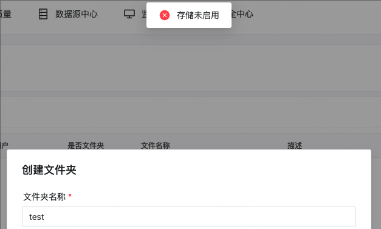
</center>

__Solution:__
#### 1. K8s:
update values.yaml as follow:
```yaml
common:
  configmap:
    RESOURCE_STORAGE_TYPE: "HDFS"
    RESOURCE_UPLOAD_PATH: "/dolphinscheduler"
    FS_DEFAULT_FS: "file:///"
  fsFileResourcePersistence:
    enabled: true
    accessModes:
    - "ReadWriteMany"
    storageClassName: "-"
    storage: "20Gi"
```
The values of storageClassName and storage depend on actual value.

Attention: storageClassName must support access mode: _ReadWriteMany_.

#### 2. Cluster
修改 /path/to/ds/conf/config/install_config.conf
```shell
# resource storage type: HDFS, S3, NONE
resourceStorageType="HDFS"

# resource store on HDFS/S3 path, resource file will store to this hdfs path, self configuration, please make sure the directory exists on hdfs and has read write permissions. "/dolphinscheduler" is recommended
resourceUploadPath="/dolphinscheduler"

# if resourceStorageType is HDFS，defaultFS write namenode address，HA, you need to put core-site.xml and hdfs-site.xml in the conf directory.
# if S3，write S3 address，HA，for example ：s3a://dolphinscheduler，
# Note，S3 be sure to create the root directory /dolphinscheduler
defaultFS="file:///"
```
__make sure that user owns the right to access the folder__

### 4. work group default have not received the heartbeat
> Cause：In multi-NIC environment, zookeeper, dolphinscheduler, /etc/hosts and so on should be config correctly.
<center>
   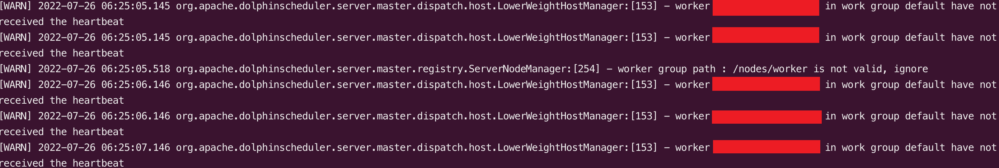
</center>

__Solution:__

1. _ipconfig -a_: check NIC
<center>
   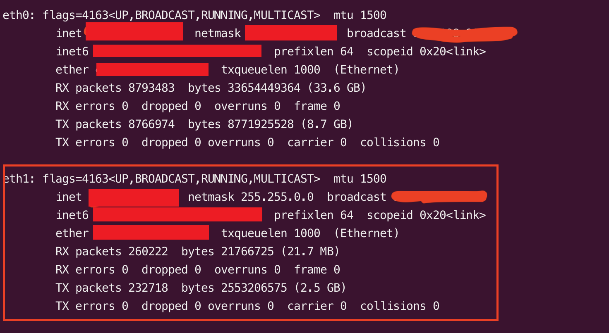
</center>

2. _cat /etc/hosts_: ip map
```shell
# 178.128.123.18 backend-pulsar-101
# 128.199.160.80 backend-pulsar-102
# 143.198.195.83 backend-pulsar-103
10.130.144.26 backend-pulsar-101
10.130.145.44 backend-pulsar-102
10.130.144.31 backend-pulsar-103
```

3. _conf/common.properties_: dolphinscheduler register ip in zookeeper
```shell
# network interface preferred like eth0, default: empty
dolphin.scheduler.network.interface.preferred=eth1

# network IP gets priority, default: inner outer
dolphin.scheduler.network.priority.strategy=outer
```

## Reference
1. [Dolphinscheduler(2.0.5) docker deploy](https://dolphinscheduler.apache.org/en-us/docs/2.0.5/user_doc/guide/installation/docker.html)
2. [ProgrammerSought: dolphinscheduler-2.0.3](https://programmersought.com/article/432910485874/)
3. [Dolphinscheduler + Mysql搭建部署](https://www.its203.com/article/yj970605/121029526)
4. [Dolphinscheduler 上传文件出现租户不存在的问题](https